<div align="center">


# Vashudha

**The carbon credit marketplace powered by real food rescue data.**

Post surplus food → Feed communities → Earn verified carbon credits → Sell to enterprises.

[](LICENSE)
[](https://nextjs.org)
[](https://flask.palletsprojects.com)
[](https://supabase.com)
[](https://polygon.technology)

</div>

---

## What is Vasudha?

Vasudha is a **three-sided marketplace** that turns the act of rescuing surplus food into a financially auditable carbon reduction event — and sells that proof to enterprises as verified carbon credits.

> **For restaurants:** Post surplus food in 60 seconds. Get paid in carbon credits when it reaches someone who needs it.
>
> **For enterprises:** Buy blockchain-anchored carbon offsets backed by food rescue data you can independently verify on Polygonscan — not promises from a rainforest you've never seen.
>
> **For NGOs:** Receive real-time dispatch, optimised routing, and a sustainable income stream from the platform.

---

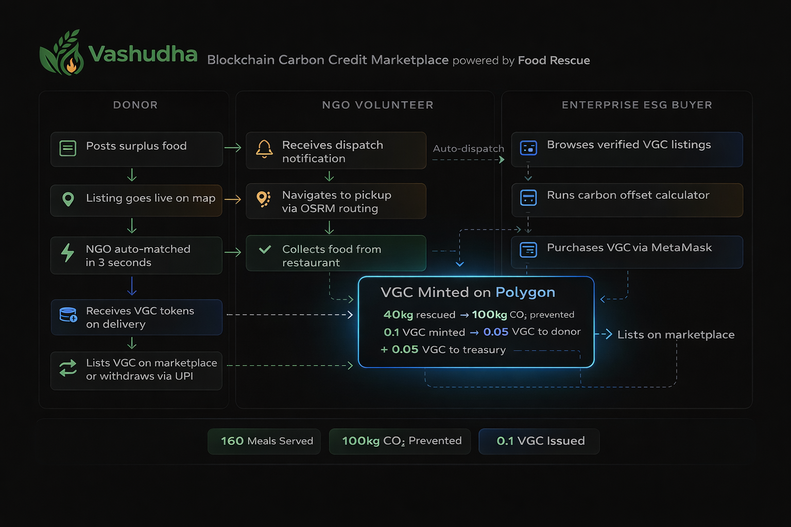

---

## The Market Problem

| Signal | Data |
|---|---|
| Food wasted in India annually | **68 million tonnes** |
| Indians facing food insecurity | **200 million** |
| CO₂ emitted per kg food in landfill | **2.5 kg CO₂e** |
| Global voluntary carbon credit market (2024) | **$12.7 billion** |
| Carbon credits found to be unverifiable by auditors | **94% of leading rainforest offsets** (Guardian, 2023) |
| Enterprises penalised under India's ESG disclosure mandate | Growing post-BRSR Core (FY24) |

The carbon credit market has a credibility crisis. Buyers have no way to independently verify that the reduction they purchased actually happened. Vasudha solves this with a data trail that starts at a restaurant kitchen and ends on a public blockchain.

---

## How the Platform Works

```
  1. RESTAURANT POSTS FOOD
     "40kg biryani, expires in 2 hours, pickup: MI Road, Jaipur"
     │
     ▼
  2. AI DISPATCH  (< 3 seconds)
     Haversine distance sort across active NGOs
     OSRM free routing API calculates optimal path
     NGO volunteer receives assignment on their phone
     │
     ▼
  3. RESCUE LIFECYCLE  (Volunteer taps through on mobile)
     Dispatched → Collected from restaurant → Delivered to hunger zone
     GPS + timestamp anchored at every step
     │
     ▼
  4. IMPACT CALCULATION  (on delivery confirmation)
     40 kg rescued
     × 4 meals/kg  = 160 meals served
     × 2.5 kg CO₂  = 100 kg CO₂e prevented = 0.1 tonnes
     │
     ▼
  5. VGC MINTED ON POLYGON  (backend only — never from client)
     0.1 VGC total
     ├── 0.05 VGC → Restaurant wallet  (50%)
     └── 0.05 VGC → Vasudha treasury  (50%)
     │
     ▼
  6. IMMUTABLE MRV RECORD
     Certificate issued with Polygon tx hash
     Publicly auditable — anyone can verify on Polygonscan
     │
     ▼
  7. ENTERPRISE MARKETPLACE
     ESG buyer browses verified VGC listings
     Purchases via MetaMask (MATIC) or B2B invoice (INR)
     Credits retired on-chain → PDF ESG certificate generated
```

---

## Platform Screenshots

<table>
  <tr>
    <td>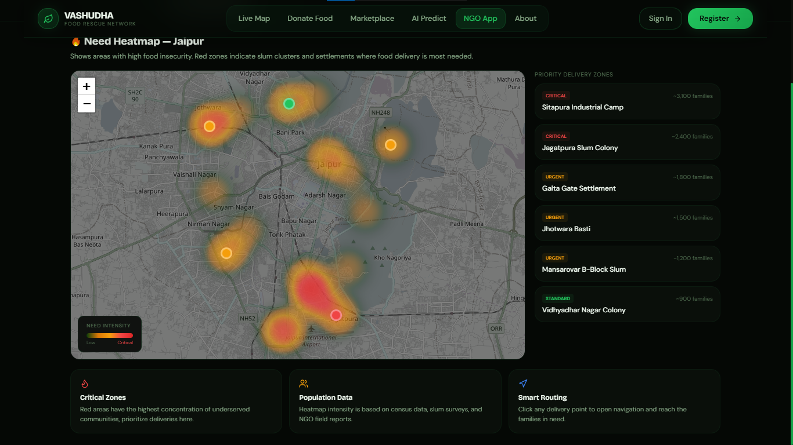</td>
    <td>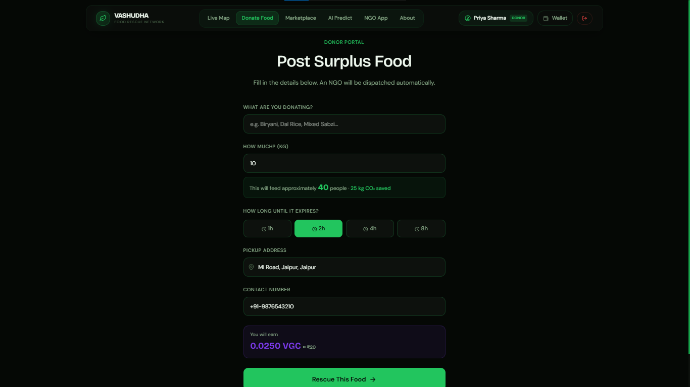</td>
  </tr>
  <tr>
    <td align="center"><strong>Live Command Center</strong> — Real-time map with hunger heatmap, active rescues, and animated route lines</td>
    <td align="center"><strong>Donor Portal</strong> — Post surplus in under 60 seconds with live meal preview</td>
  </tr>
  <tr>
    <td>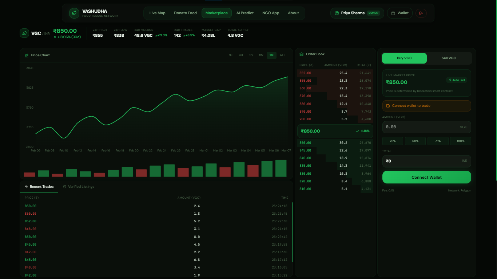</td>
    <td>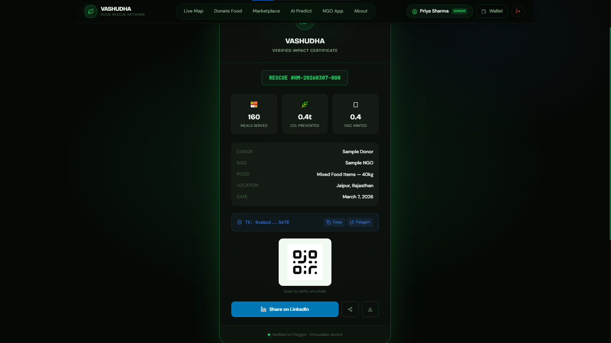</td>
  </tr>
  <tr>
    <td align="center"><strong>Carbon Marketplace</strong> — Verified VGC listings with blockchain proof links and carbon offset calculator</td>
    <td align="center"><strong>Impact Certificate</strong> — Shareable, on-chain verifiable rescue certificate with QR code</td>
  </tr>
  <tr>
    <td>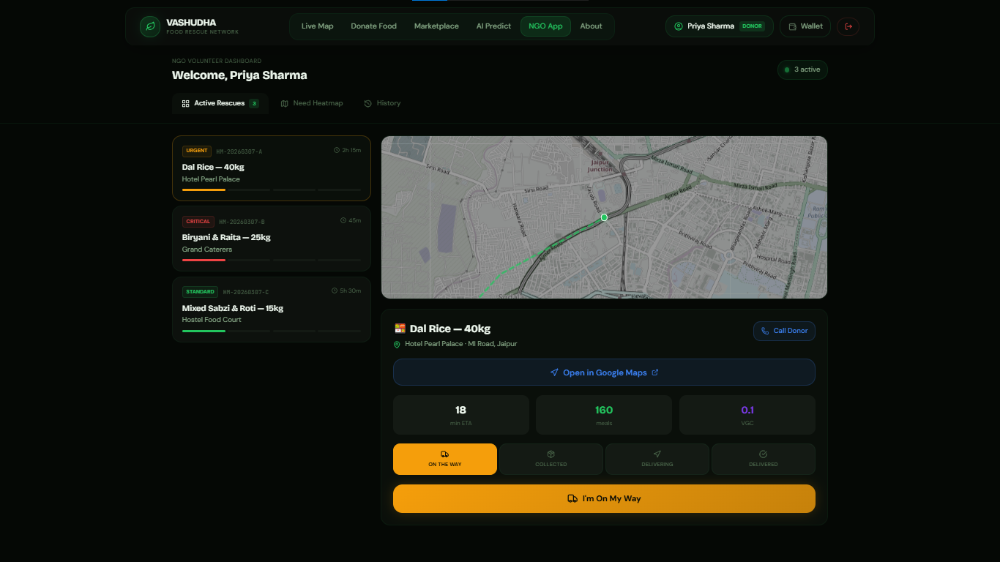</td>
    <td>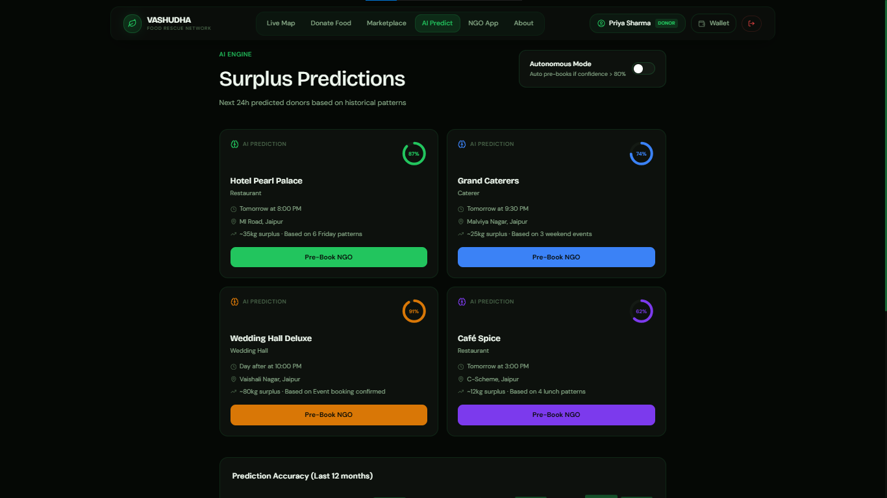</td>
  </tr>
  <tr>
    <td align="center"><strong>NGO Dispatch App</strong> — Mobile-first volunteer interface with OSRM turn-by-turn routing</td>
    <td align="center"><strong>AI Prediction Panel</strong> — Claude-powered surplus forecast with confidence scoring</td>
  </tr>
</table>

---

## Table of Contents

1. [VGC Token Economics](#vgc-token--vasudha-green-credit)
2. [User Onboarding](#user-onboarding)
   - [Restaurants & Donors](#1-restaurants--donors)
   - [NGO Volunteers](#2-ngo-volunteers)
   - [Enterprise ESG Buyers](#3-enterprise-esg-buyers)
   - [Platform Admin](#4-platform-admin)
3. [Wallet Setup — MetaMask Guide](#wallet-setup--metamask-guide)
4. [Buying VGC (Enterprise)](#buying-vgc--enterprise-flow)
5. [Selling VGC (Donor)](#selling-vgc--donor-flow)
6. [NGO Volunteer Delivery Flow](#ngo-volunteer-delivery-flow)
7. [Tech Stack](#tech-stack)
8. [Architecture](#architecture)
9. [File & Folder Structure](#file--folder-structure)
10. [Database Schema](#database-schema)
11. [API Reference](#api-reference)
12. [Environment Variables](#environment-variables)
13. [Local Setup](#local-setup)
14. [Deployment](#deployment)
15. [Carbon Credit Methodology](#carbon-credit-methodology)
16. [Roadmap](#roadmap)
17. [Contributing](#contributing)
18. [License](#license)

---

## VGC Token — Vasudha Green Credit

**VGC** is an ERC-20 token on Polygon. Each token represents exactly **1 tonne of CO₂-equivalent** prevented through documented food rescue. VGC is never pre-minted, never speculative, and never issued without a corresponding MRV data record.

### Minting Formula

```
1 kg food rescued  =  2.5 kg CO₂e prevented
1,000 kg CO₂e     =  1 tonne CO₂e
1 tonne CO₂e      =  1 VGC minted
```

### Token Distribution (per rescue)

```
              VGC Minted
                  │
        ┌─────────┴─────────┐
        │                   │
      50%                 50%
        │                   │
  Donor Wallet       Vasudha Treasury
  (Restaurant)       (Marketplace pool
                      + operations)
```

### Floor Price

The VGC floor price is **₹800 per token** (1 tonne CO₂e), enforced by the Marketplace smart contract. India's CCTS Voluntary Offset Mechanism (Bureau of Energy Efficiency, 2025) prices verified food waste credits at ₹600–900 per tonne — Vasudha's floor is at parity from launch.

### Token Lifecycle

```
  Rescue Completed
       │
       ▼
  Backend Mints VGC           ← Smart contract mint(), never from client
       │
       ├─▶ Donor holds VGC    → Lists on marketplace or requests UPI withdrawal
       │
       └─▶ Vasudha treasury   → Listed on marketplace for enterprise buyers
                                     │
                                     ▼
                              Enterprise Purchases VGC
                                     │
                                     ▼
                              Enterprise Retires VGC  ← burn() on-chain
                                     │
                                     ▼
                              Retirement Certificate Issued
                              (Permanent proof — cannot be resold)
```

---

## User Onboarding

### 1. Restaurants & Donors

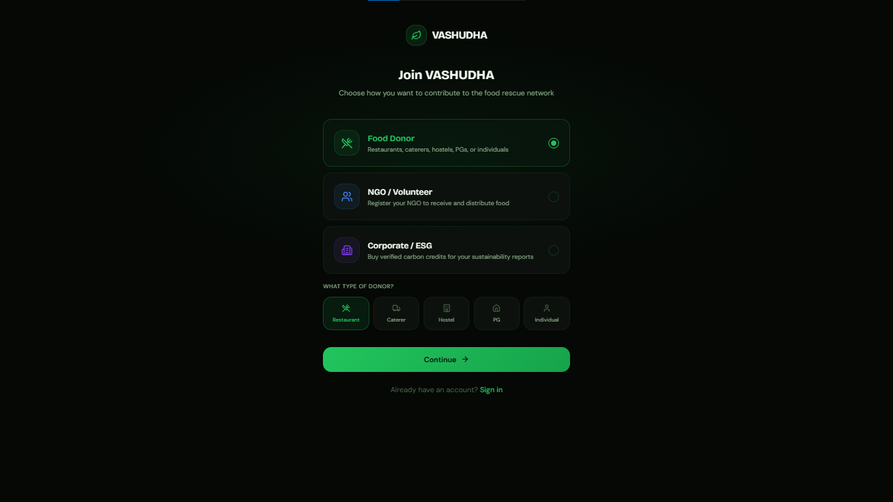
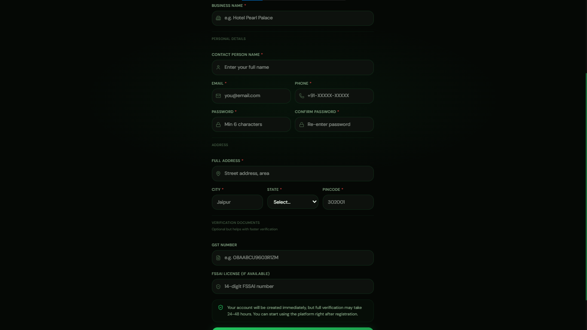

**Step 1 — Register at `/donate`**

No email, no password. Registration takes under 60 seconds.

```
Required fields:
  • Business name
  • Type: Restaurant / Caterer / Wedding Hall / Hotel / Household
  • Address  (OpenStreetMap autocomplete)
  • Phone number
  • Typical surplus capacity (kg)
```

**Step 2 — Receive your Donor ID**

Vasudha creates your profile and returns a UUID Donor ID. This is stored in your browser's `localStorage` and sent as `X-Donor-Id` on all future requests. No session management required.

**Step 3 — Connect wallet (optional)**

Click **"Connect MetaMask"** on your dashboard to link a Polygon wallet address. VGC tokens will appear directly in MetaMask. If you skip this step, your VGC balance is tracked internally — connect at any time and your accumulated balance carries over.

> **No wallet?** See [Wallet Setup Guide](#wallet-setup--metamask-guide) or use the [UPI withdrawal path](#selling-vgc--donor-flow) — no crypto knowledge needed.

**Step 4 — Post surplus food**

```
Required fields:
  • Food description       e.g. "Dal, Rice, Sabzi — freshly cooked"
  • Quantity in kg         (live counter shows "This feeds ~N people")
  • Expiry window          1h / 2h / 4h / 8h
  • Pickup address         (pre-filled from profile)
```

Submit → an NGO is auto-matched and dispatched within 10 seconds.

**Donor Dashboard (`/donor/:id`)**

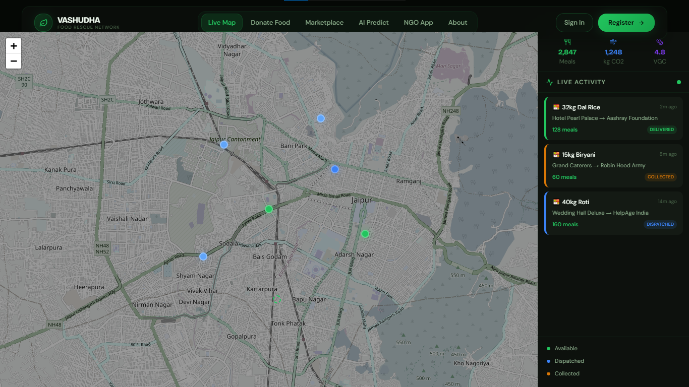

```
  Lifetime Stats
  ├── Total meals served
  ├── Total CO₂ prevented (kg)
  ├── VGC balance (tokens + INR equivalent at floor price)
  └── Total rescue count

  Rescue History  (paginated, newest first)
  └── Each row: food type · quantity · NGO · date · VGC earned · [Certificate]
```

---

### 2. NGO Volunteers


**Step 1 — NGO coordinator registers at `/ngo`**

```
Required fields:
  • Organisation name
  • Address and city
  • Contact phone
  • Operational capacity (kg)
```

Registration is submitted for admin review. Once approved, the NGO is active on the platform.

**Step 2 — Coordinator shares NGO ID with volunteers**

Volunteers open `/ngo` on any mobile browser and enter the NGO ID. No app download, no signup — the dispatch interface is a fully responsive PWA.

**Step 3 — Assignments appear automatically**

Active food listings in the NGO's city appear in the dispatch view. New assignments push in without a page refresh (5-second polling).

See [NGO Volunteer Delivery Flow](#ngo-volunteer-delivery-flow) for the complete step-by-step.

---

### 3. Enterprise ESG Buyers

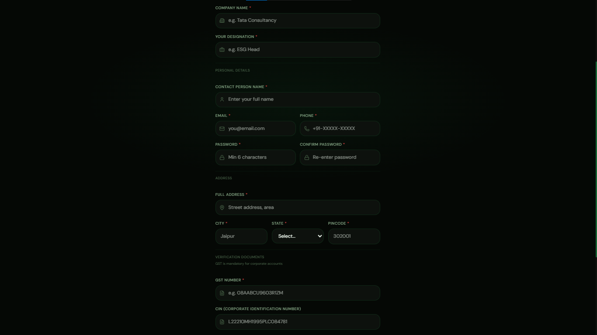

**Step 1 — Browse marketplace at `/marketplace`**

No registration required. All active VGC listings are publicly visible with blockchain proof links.

**Step 2 — Use the carbon offset calculator**

```
  Input:  Annual CO₂ emissions in tonnes
  Output: VGC tokens needed
          Estimated cost at current market price
          Links to suitable listings
```

**Step 3 — Connect MetaMask and purchase**

Click **"Buy with MetaMask"** on any listing, confirm the MATIC transaction. VGC transfers to your wallet immediately.

**Step 4 — Download ESG certificate**

A PDF certificate is generated containing:

- Buyer entity name
- CO₂ offset quantity (tonnes)
- VGC token IDs
- Blockchain transaction hash
- Vasudha MRV verification statement
- QR code linking to on-chain proof

Accepted for voluntary ESG disclosure under India's BRSR Core framework and CSR compliance under Companies Act Section 135.

---

### 4. Platform Admin

**Access:** Navigate to `/admin` and authenticate with the `ADMIN_SECRET` environment variable. All admin API routes require the `X-Admin-Secret` request header.

```
  Rescue Management    View all rescues filtered by status, city, date range
  NGO Management       Approve / deactivate NGOs, view performance
  Treasury             VGC balance, sold history, INR value at floor price
  Pricing              Update VGC floor price (enforced in smart contract)
  Hunger Zones         Add / remove heatmap coordinates per city
  AI Prediction        Toggle autonomous pre-booking mode on/off
  Analytics            Platform-wide rescue rate, city breakdown, timeline
  Seed Data            One-click demo data for any city
```

---

## Wallet Setup — MetaMask Guide

Vasudha uses **Polygon** for all on-chain activity. MetaMask is the recommended wallet for both donors and enterprise buyers.

### First-Time Setup

**Step 1 — Install MetaMask**
- Desktop: [metamask.io](https://metamask.io) → Chrome / Firefox / Brave extension
- Mobile: MetaMask app from App Store or Google Play

**Step 2 — Create your wallet**
- Click "Create a new wallet" and set a password
- **Write your 12-word Secret Recovery Phrase on paper. Store it offline. Never share it.**

**Step 3 — Add Polygon Mainnet**

In MetaMask → Settings → Networks → Add Network:

```
Network Name:    Polygon Mainnet
RPC URL:         https://polygon-rpc.com
Chain ID:        137
Currency Symbol: MATIC
Block Explorer:  https://polygonscan.com
```

For testnet development:

```
Network Name:    Polygon Amoy Testnet
RPC URL:         https://rpc-amoy.polygon.technology
Chain ID:        80002
Currency Symbol: MATIC
Block Explorer:  https://amoy.polygonscan.com
```

**Step 4 — Fund your wallet with MATIC**
- Mainnet: Purchase MATIC on any Indian exchange (CoinDCX, WazirX) and withdraw to your address
- Testnet: Use [faucet.polygon.technology](https://faucet.polygon.technology) for free test MATIC

**Step 5 — Import VGC token**

MetaMask → Import Token → paste the VGC contract address from your `.env`. The token will appear as "VGC".

**Step 6 — Connect to Vasudha**

Click **"Connect Wallet"** on any Vasudha page. MetaMask prompts for connection approval. Your address is saved to your Vasudha profile automatically.

### No-Wallet Path for Donors

Wallet connection is entirely optional. Without MetaMask:
- VGC earned is tracked in Vasudha's database with full balance history
- Sell via **Vasudha Managed Buyback** — Vasudha purchases your VGC at floor price and transfers INR to your UPI ID within 24 hours
- Connect a wallet at any time — accumulated balance transfers automatically

---

## Buying VGC — Enterprise Flow


### Self-Serve (Marketplace)

1. Go to `/marketplace/buy`
2. Filter listings by quantity, price per VGC, or seller type
3. Each listing shows:
   - Available VGC quantity
   - Price per VGC (INR)
   - Seller (restaurant name or Vasudha Treasury)
   - Verification badge → links to Polygonscan rescue record
4. Click **"Buy with MetaMask"**
5. Confirm MATIC transaction → VGC transfers to your wallet
6. Click **"Download ESG Certificate"**

### Retiring Credits (ESG Compliance)

To prevent double-counting, enterprises should retire VGC after purchasing.

1. Go to `/marketplace` → **"Retire My Credits"**
2. Select amount to retire
3. MetaMask calls `burn()` on the VGC contract
4. Credits permanently destroyed on-chain
5. **Retirement Certificate** issued with burn transaction hash — suitable for BRSR and annual sustainability reports

### B2B Packages (> 100 VGC)

For bulk purchases:
- INR invoice with GST
- Volume pricing
- Custom MRV report per industry vertical
- Annual subscription for continuous offsetting

---

## Selling VGC — Donor Flow

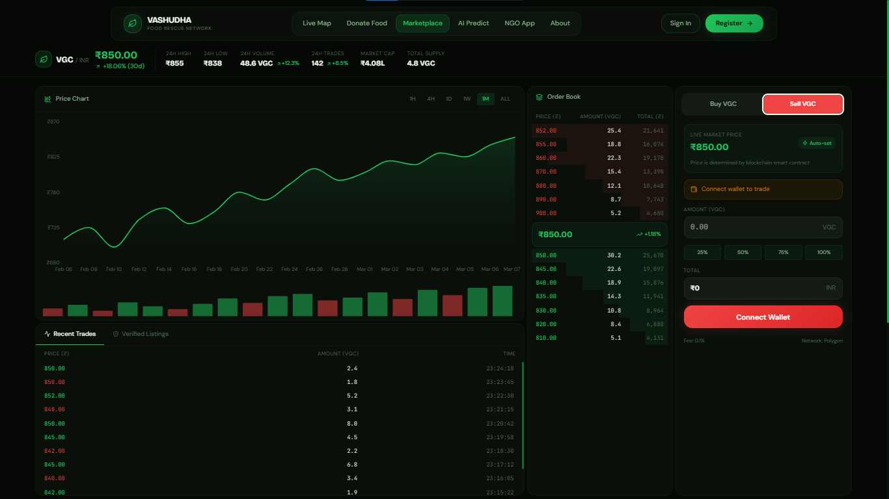

### Path A — Marketplace (MetaMask)

1. Go to `/marketplace/sell`
2. View available VGC balance
3. Enter quantity to list and price per VGC (minimum: floor price)
4. Click **"List for Sale"** — VGC is escrowed in the smart contract
5. When a buyer purchases, MATIC arrives in your MetaMask wallet automatically

### Path B — Vasudha Managed Buyback (No Crypto)

1. Donor dashboard → **"Withdraw to UPI"**
2. Enter your UPI ID
3. Vasudha purchases your VGC at floor price
4. INR transferred within 24 hours

### Path C — Cancel a Listing

Cancel any active listing from `/marketplace/my-listings`. Escrowed VGC returns to your balance immediately.

---

## NGO Volunteer Delivery Flow

The volunteer interface is built for a single-handed mobile experience on a low-end Android browser. No app download required.


**Step 1 — Open `/ngo` on your phone**

Enter your NGO ID. Active assignments appear automatically.

**Step 2 — Review assignment**

```
  Rescue Assignment
  ├── Food description and quantity
  ├── Donor name and tap-to-call phone number
  ├── Pickup address
  ├── Expiry countdown timer
  └── Estimated travel time (OSRM)
```

**Step 3 — Tap "I'm On My Way"**

Map draws your route from your current location to the pickup address using OSRM free routing (OpenStreetMap-based, no API key). Turn-by-turn instructions appear below the map. The donor's tracking screen updates live.

**Step 4 — Tap "I've Collected The Food"**

After collecting from the restaurant. The map redraws the route from pickup to the nearest active hunger zone.

**Step 5 — Tap "I've Delivered It"**

This single tap triggers the full delivery confirmation:

```
  ✅ Listing status → 'rescued'
  ✅ VGC minted on Polygon (Flask backend)
  ✅ 50% VGC credited to donor wallet
  ✅ 50% VGC added to Vasudha treasury
  ✅ Impact certificate generated
  ✅ Global impact counters incremented
  ✅ Donor tracking card updates to completion
```

---

## Tech Stack

### Frontend

| Technology | Version | Purpose |
|---|---|---|
| Next.js | 14 (App Router) | React framework, SSR, file-based routing |
| TypeScript | 5.x | End-to-end type safety |
| Tailwind CSS | 3.x | Utility-first styling |
| shadcn/ui | Latest | Headless component base |
| Framer Motion | Latest | Page transitions, scroll animations |
| Leaflet.js + react-leaflet | 1.9 / 4.x | Interactive maps, heatmap layer, route polylines |
| ethers.js | v6 | MetaMask wallet connection, on-chain transactions |
| SWR | Latest | Data fetching with 5-second polling |
| react-hook-form + zod | Latest | Form handling and validation |
| recharts | Latest | Impact charts |
| react-countup | Latest | Animated impact number counters |
| react-hot-toast | Latest | Live event notifications |

**Map providers (all free, no API key required):**
- Tiles: OpenStreetMap (`tile.openstreetmap.org`)
- Geocoding: Nominatim (`nominatim.openstreetmap.org`)
- Routing: OSRM (`router.project-osrm.org`)

### Backend

| Technology | Version | Purpose |
|---|---|---|
| Flask | 3.0.3 | Python web framework |
| flask-cors | 4.0.1 | Cross-origin resource sharing |
| supabase-py | 2.4.6 | Database client (service-role, server-only) |
| Anthropic SDK | 0.28.0 | Claude Sonnet 4 surplus prediction |
| APScheduler | 3.10.4 | Background jobs (listing expiry, autonomous prediction) |
| requests | 2.31.0 | OSRM routing API calls |
| gunicorn | 22.0.0 | Production WSGI server |

### Infrastructure & Blockchain

| Technology | Purpose |
|---|---|
| Supabase (PostgreSQL) | Primary database |
| Polygon (Amoy testnet → Mainnet) | ERC-20 VGC token, Marketplace, Impact Registry contracts |
| Vercel | Frontend hosting |
| Railway | Flask backend hosting |
| Claude Sonnet 4 | AI surplus prediction engine |

---

## Architecture


```
┌─────────────────────────────────────────────────────────────────────┐
│                          CLIENT LAYER                               │
│                                                                     │
│   Next.js (Vercel)                                                  │
│   ├── App Router pages                                              │
│   ├── SWR polling (5s) → Flask REST API                             │
│   ├── ethers.js → Polygon (MetaMask)        ← buy / retire only    │
│   └── Leaflet → OpenStreetMap tiles (free)                          │
└────────────────────────┬────────────────────────────────────────────┘
                         │ HTTP REST
┌────────────────────────▼────────────────────────────────────────────┐
│                          API LAYER                                  │
│                                                                     │
│   Flask (Railway)                                                   │
│   ├── /api/listings    → matching.py → routing.py (OSRM)           │
│   ├── /api/rescues     → calculations.py → carbon_credits table     │
│   ├── /api/predict     → ai_predict.py → Anthropic API             │
│   ├── /api/marketplace → escrow logic (no blockchain here)          │
│   ├── /api/admin       → analytics, NGO approval, treasury          │
│   └── APScheduler      → expiry job (hourly) + predict (3 PM)      │
└──────────┬──────────────────────┬──────────────────────────────────┘
           │                      │
┌──────────▼──────────┐  ┌───────▼────────────────────────────────┐
│   DATABASE LAYER    │  │          BLOCKCHAIN LAYER               │
│                     │  │                                         │
│   Supabase          │  │   Polygon (Amoy → Mainnet)              │
│   ├── donors        │  │   ├── VGCToken.sol  (ERC-20, mint/burn) │
│   ├── listings      │  │   ├── ImpactRegistry.sol  (MRV records) │
│   ├── rescues       │  │   └── Marketplace.sol  (list/buy/retire)│
│   ├── ngos          │  │                                         │
│   ├── carbon_credits│  │   Backend calls mint() on delivery      │
│   ├── marketplace_  │  │   Frontend calls buy() / retire() only  │
│   │   listings      │  │                                         │
│   └── ...12 tables  │  └─────────────────────────────────────────┘
└─────────────────────┘
```

**Key architectural decisions:**
- The frontend **never** calls Supabase directly — all data flows through Flask
- VGC **minting** happens exclusively in the Flask backend (private key never exposed)
- VGC **buying and retiring** happen from the user's own MetaMask wallet (user controls their key)
- OSRM and Nominatim are called from the **backend** — not exposed to clients

---

## File & Folder Structure

```
vasudha/
│
├── README.md
├── LICENSE
│
├── frontend/                              # Next.js 14 Application
│   ├── package.json
│   ├── tailwind.config.js
│   ├── tsconfig.json
│   ├── next.config.js
│   ├── .env.local.example
│   │
│   └── src/
│       ├── app/                           # App Router pages
│       │   ├── layout.tsx                 # Root layout, providers, navbar
│       │   ├── page.tsx                   # Landing page
│       │   ├── dashboard/page.tsx         # Live command center
│       │   ├── donate/page.tsx            # Food listing form
│       │   ├── donor/[id]/page.tsx        # Donor personal dashboard
│       │   ├── ngo/page.tsx               # NGO volunteer dispatch
│       │   ├── marketplace/
│       │   │   ├── page.tsx               # Marketplace overview
│       │   │   ├── buy/page.tsx           # Buy VGC flow
│       │   │   └── sell/page.tsx          # List VGC for sale
│       │   ├── predict/page.tsx           # AI prediction panel
│       │   ├── certificate/[id]/page.tsx  # Shareable blockchain certificate
│       │   ├── admin/page.tsx             # Admin panel
│       │   └── about/page.tsx             # Mission page
│       │
│       ├── components/
│       │   ├── ui/                        # shadcn base components
│       │   ├── map/
│       │   │   ├── LiveMap.tsx            # Full-screen dashboard map (ssr: false)
│       │   │   ├── NGORouteMap.tsx        # Volunteer route + directions
│       │   │   └── layers/
│       │   │       ├── HeatmapLayer.tsx   # Leaflet.heat hunger zones
│       │   │       ├── ListingMarkers.tsx # Pulsing food listing pins
│       │   │       └── RoutePolyline.tsx  # Animated rescue routes
│       │   ├── dashboard/
│       │   │   ├── ImpactCounter.tsx      # Animated global stat counters
│       │   │   ├── ActivityFeed.tsx       # Real-time rescue events sidebar
│       │   │   └── ListingCard.tsx
│       │   ├── donor/
│       │   │   ├── FoodPostingForm.tsx
│       │   │   └── TrackingCard.tsx       # Post-submit rescue status
│       │   ├── marketplace/
│       │   │   ├── CreditListingCard.tsx
│       │   │   ├── CarbonCalculator.tsx
│       │   │   └── ESGCertificate.tsx
│       │   └── blockchain/
│       │       ├── ConnectWallet.tsx      # MetaMask connect button
│       │       └── NetworkGuard.tsx       # Polygon network switch prompt
│       │
│       ├── lib/
│       │   ├── api.ts                     # Typed API client (all Flask calls)
│       │   ├── contracts/
│       │   │   ├── VGCToken.abi.json
│       │   │   ├── Marketplace.abi.json
│       │   │   └── ImpactRegistry.abi.json
│       │   ├── web3.ts                    # ethers.js wallet helpers
│       │   ├── calculations.ts            # Client-side CO₂/meals preview
│       │   └── utils.ts                   # cn() and shared utilities
│       │
│       ├── hooks/
│       │   ├── useWallet.ts               # MetaMask connection state
│       │   ├── useImpactStats.ts          # Global impact polling
│       │   ├── useRescueTracking.ts       # Rescue status polling
│       │   └── useMarketplace.ts          # VGC listings data
│       │
│       └── types/
│           ├── listing.ts
│           ├── rescue.ts
│           ├── donor.ts
│           ├── ngo.ts
│           └── marketplace.ts
│
├── backend/                               # Flask REST API
│   ├── app.py                             # Entry point, blueprints, scheduler
│   ├── config.py                          # Env-driven configuration
│   ├── requirements.txt
│   ├── schema.sql                         # Run in Supabase SQL Editor
│   ├── .env.example
│   │
│   ├── routes/
│   │   ├── listings.py                    # POST food, GET map pins, track
│   │   ├── ngos.py                        # Registration, active list, assignments
│   │   ├── rescues.py                     # Status updates → VGC mint trigger
│   │   ├── impact.py                      # Global stats, timeline, cities
│   │   ├── donors.py                      # Registration, dashboard, history
│   │   ├── predict.py                     # AI predictions, prebook, autonomous
│   │   ├── heatmap.py                     # Hunger zone coordinates
│   │   ├── marketplace.py                 # VGC list/buy/cancel (no blockchain)
│   │   ├── certificates.py                # Certificate data by ID
│   │   └── admin.py                       # NGO approval, treasury, analytics
│   │
│   ├── services/
│   │   ├── supabase_client.py             # Singleton client, service-role key
│   │   ├── matching.py                    # Haversine → OSRM → rescue record
│   │   ├── routing.py                     # OSRM API + Haversine fallback
│   │   ├── ai_predict.py                  # Claude surplus prediction
│   │   └── calculations.py               # Pure functions: CO₂, meals, VGC
│   │
│   └── middleware/
│       └── auth.py                        # require_admin, require_donor
│
└── contracts/                             # Solidity Smart Contracts
    ├── VGCToken.sol                       # ERC-20, mint (backend) + burn (user)
    ├── ImpactRegistry.sol                 # Immutable rescue records on-chain
    ├── Marketplace.sol                    # List, buy, retire VGC
    ├── hardhat.config.js
    ├── package.json
    └── scripts/
        └── deploy.js                      # Hardhat deploy to Polygon Amoy
```

---

## Database Schema

All 12 tables are defined in `backend/schema.sql`. Run the full file in your Supabase SQL Editor.

```
donors                   ngos
─────────────────        ─────────────────
id (uuid, PK)            id (uuid, PK)
name                     name
type                     address
phone (unique)           city
location (jsonb)         phone (unique)
hgc_balance              location (jsonb)
wallet_address           capacity_kg
city                     active (bool)
created_at               created_at


listings                 rescues
─────────────────        ─────────────────────
id (uuid, PK)            id (uuid, PK)
donor_id → donors        listing_id → listings
rescue_id → rescues      ngo_id → ngos
food_description         donor_id → donors
quantity_kg              status
expiry_window_hours      route_polyline
pickup_lat / lng         distance_km
pickup_address           meals_served
status                   co2_prevented_kg
created_at               total_vgc
                         donor_vgc
                         harvestmind_vgc
                         certificate_id
                         delivered_at


impact_certificates      carbon_credits  (ledger)
───────────────────      ─────────────────────────
id (uuid, PK)            id (uuid, PK)
rescue_id                rescue_id
donor_id                 donor_id
ngo_id                   wallet_type
meals_served             amount_vgc
co2_prevented_kg         type  (mint/escrow/sale)
total_vgc                created_at
blockchain_tx
issued_at


marketplace_listings     hgc_purchases
────────────────────     ────────────────────
id (uuid, PK)            id (uuid, PK)
seller_donor_id          listing_id
amount_vgc               buyer_company
price_per_vgc_inr        amount_vgc
status                   total_inr
created_at               blockchain_tx
                         purchased_at


hunger_zones             donor_patterns   (AI training data)
────────────────         ─────────────────────────────────────
id (uuid, PK)            id (uuid, PK)
location (jsonb)         donor_id
hunger_intensity         day_of_week  (0–6)
area_name                time_of_day  (morning/afternoon/evening)
city                     avg_surplus_kg
                         frequency


settings                 hgc_price_history
──────────────           ─────────────────
key (unique)             price_inr
value                    amount_vgc
                         recorded_at
```

---

## API Reference

**Base URL:** `http://localhost:5000` (development) | Your Railway URL (production)

**Auth headers:**

| Header | Required for |
|---|---|
| `X-Admin-Secret` | All `/api/admin/*` routes |
| `X-Donor-Id` | Donor-specific reads |
| `X-NGO-Id` | NGO dispatch routes |

---

### Listings

| Method | Endpoint | Auth | Description |
|---|---|---|---|
| `GET` | `/api/listings/active` | — | All available + claimed listings for map |
| `POST` | `/api/listings/create` | — | Post surplus food, auto-dispatches NGO |
| `GET` | `/api/listings/:id/track` | — | Real-time rescue tracking state |
| `GET` | `/api/listings/recent` | — | Last 20 rescued listings for activity feed |

**`POST /api/listings/create`**
```json
{
  "donor_id": "uuid",
  "food_description": "Dal Rice + Sabzi",
  "quantity_kg": 40,
  "expiry_window_hours": 2,
  "pickup_address": "Hotel Pearl Palace, MI Road, Jaipur",
  "pickup_lat": 26.9118,
  "pickup_lng": 75.7919
}
```

Response includes: listing, matched NGO, OSRM route, preview impact numbers (meals, CO₂, VGC).

---

### NGOs

| Method | Endpoint | Auth | Description |
|---|---|---|---|
| `GET` | `/api/ngos/active` | — | Active NGOs for map |
| `POST` | `/api/ngos/register` | — | Register NGO (pending admin approval) |
| `GET` | `/api/ngos/:id` | — | NGO profile |
| `GET` | `/api/ngos/:id/assignments` | — | Active dispatch queue for a volunteer |

---

### Rescues

| Method | Endpoint | Auth | Description |
|---|---|---|---|
| `PATCH` | `/api/rescues/:id/update` | — | NGO updates rescue status |
| `GET` | `/api/rescues/:id` | — | Full rescue detail with joined tables |
| `GET` | `/api/rescues/live` | — | In-progress rescues for map route lines |

**`PATCH /api/rescues/:id/update`**
```json
{ "status": "collected" }
```
Valid transitions: `dispatched → collected → delivered`

On `delivered`: mints VGC, credits donor balance, creates certificate, updates global stats.

---

### Donors

| Method | Endpoint | Auth | Description |
|---|---|---|---|
| `POST` | `/api/donors/register` | — | Register new donor |
| `GET` | `/api/donors/:id/dashboard` | — | Stats, VGC balance, recent rescues |
| `GET` | `/api/donors/:id/history` | — | Paginated rescue history |
| `POST` | `/api/donors/:id/wallet` | — | Link MetaMask address |

---

### Impact

| Method | Endpoint | Auth | Description |
|---|---|---|---|
| `GET` | `/api/impact/global` | — | Live totals: meals, CO₂, VGC, active rescues |
| `GET` | `/api/impact/timeline` | — | Last 30 days daily data for charts |
| `GET` | `/api/impact/cities` | — | Per-city breakdown |

---

### AI Prediction

| Method | Endpoint | Auth | Description |
|---|---|---|---|
| `GET` | `/api/predict/upcoming` | — | Claude-powered predictions for next 24h |
| `POST` | `/api/predict/prebook` | Admin | Pre-book NGO for a predicted listing |
| `POST` | `/api/predict/autonomous` | Admin | Toggle autonomous pre-booking |
| `GET` | `/api/predict/accuracy` | — | Historical prediction accuracy |

---

### Marketplace

| Method | Endpoint | Auth | Description |
|---|---|---|---|
| `GET` | `/api/marketplace/listings` | — | Browse active VGC listings |
| `POST` | `/api/marketplace/list` | — | List VGC for sale (escrows tokens) |
| `POST` | `/api/marketplace/buy` | — | Record completed purchase after on-chain tx |
| `POST` | `/api/marketplace/calculate` | — | Carbon offset calculator |
| `GET` | `/api/marketplace/price-history` | — | VGC/INR price history |
| `GET` | `/api/marketplace/my-listings` | — | Donor's own listings (`?donor_id=`) |
| `PATCH` | `/api/marketplace/:id/cancel` | — | Cancel listing, return escrowed VGC |

---

### Certificates

| Method | Endpoint | Auth | Description |
|---|---|---|---|
| `GET` | `/api/certificates/:id` | — | Certificate by ID |
| `GET` | `/api/certificates/rescue/:id` | — | Certificate by rescue ID |
| `GET` | `/api/certificates/donor/:id` | — | All certificates for a donor |

---

### Heatmap

| Method | Endpoint | Auth | Description |
|---|---|---|---|
| `GET` | `/api/heatmap/zones` | — | Hunger zone coordinates + intensity |
| `POST` | `/api/heatmap/zones` | Admin | Add hunger zone |
| `DELETE` | `/api/heatmap/zones/:id` | Admin | Remove zone |

---

### Admin

| Method | Endpoint | Description |
|---|---|---|
| `GET` | `/api/admin/rescues` | All rescues (filterable by status, city) |
| `GET` | `/api/admin/ngos` | All NGOs including pending |
| `POST` | `/api/admin/ngos` | Create and activate NGO directly |
| `PATCH` | `/api/admin/ngos/:id` | Approve / deactivate / edit NGO |
| `GET` | `/api/admin/treasury` | Vasudha VGC treasury balance |
| `PATCH` | `/api/admin/floor-price` | Update VGC floor price |
| `GET` | `/api/admin/analytics` | Platform-wide analytics |
| `POST` | `/api/admin/seed-demo` | Seed demo data for a city |

---

## Environment Variables

### Frontend — `frontend/.env.local`

```env
# Backend API
NEXT_PUBLIC_API_URL=http://localhost:5000

# Map defaults
NEXT_PUBLIC_MAP_CENTER_LAT=26.9124
NEXT_PUBLIC_MAP_CENTER_LNG=75.7873
NEXT_PUBLIC_MAP_DEFAULT_ZOOM=12

# Polygon (Amoy Testnet)
NEXT_PUBLIC_POLYGON_RPC=https://rpc-amoy.polygon.technology
NEXT_PUBLIC_CHAIN_ID=80002
NEXT_PUBLIC_VGC_CONTRACT_ADDRESS=0x...
NEXT_PUBLIC_MARKETPLACE_CONTRACT_ADDRESS=0x...
NEXT_PUBLIC_IMPACT_REGISTRY_ADDRESS=0x...

# Token config
NEXT_PUBLIC_VGC_FLOOR_PRICE_INR=800
```

### Backend — `backend/.env`

```env
# Supabase (service role key — never expose to client)
SUPABASE_URL=https://your-project.supabase.co
SUPABASE_SERVICE_KEY=eyJ...

# Anthropic
ANTHROPIC_API_KEY=sk-ant-...

# Application
FLASK_ENV=development
FLASK_SECRET_KEY=your-random-secret-here
ADMIN_SECRET=your-admin-password

# Carbon calculation constants
CO2_PER_KG_FOOD=2.5
MEALS_PER_KG=4
HGC_FLOOR_PRICE_INR=800
HARVESTMIND_SPLIT=0.5

# External APIs
OSRM_BASE_URL=https://router.project-osrm.org

# CORS (comma-separated)
ALLOWED_ORIGINS=http://localhost:3000,https://your-domain.vercel.app
```

---

## Local Setup

### Prerequisites

- Node.js 18+
- Python 3.11+
- Supabase account (free tier sufficient)
- Anthropic API key
- MetaMask browser extension (for wallet features)

### 1. Clone the repository

```bash
git clone https://github.com/your-org/vasudha.git
cd vasudha
```

### 2. Initialise the database

1. Create a new project at [supabase.com](https://supabase.com)
2. Open SQL Editor → New Query
3. Paste the full contents of `backend/schema.sql` and run
4. Copy your **Project URL** and **Service Role Key** from Settings → API

### 3. Start the backend

```bash
cd backend
python -m venv venv
source venv/bin/activate          # Windows: venv\Scripts\activate
pip install -r requirements.txt
cp .env.example .env
# Fill in SUPABASE_URL, SUPABASE_SERVICE_KEY, ANTHROPIC_API_KEY, ADMIN_SECRET
python app.py
```

Verify: `curl http://localhost:5000/health` → `{"status": "ok"}`

### 4. Seed demo data

```bash
curl -X POST http://localhost:5000/api/admin/seed-demo \
  -H "X-Admin-Secret: your-admin-password"
```

Creates restaurants, NGOs, and hunger zone coordinates for Jaipur.

### 5. Start the frontend

```bash
cd ../frontend
npm install
cp .env.local.example .env.local
# Fill in NEXT_PUBLIC_API_URL and contract addresses
npm run dev
```

Frontend at `http://localhost:3000`.

### 6. Deploy smart contracts (optional for local dev)

```bash
cd ../contracts
npm install
# Add your deployer private key and RPC to hardhat.config.js
npx hardhat run scripts/deploy.js --network amoy
# Copy output addresses into frontend/.env.local
```

---

## Deployment

### Frontend → Vercel

```bash
cd frontend
npx vercel --prod
# Set all NEXT_PUBLIC_* variables in the Vercel dashboard
```

### Backend → Railway

1. Push the repo to GitHub
2. New project on [railway.app](https://railway.app) → Deploy from GitHub
3. Set root directory to `backend/`
4. Add all environment variables in Railway's settings
5. Add `Procfile` in `backend/`:
```
web: gunicorn app:app --workers 2 --bind 0.0.0.0:$PORT --timeout 120
```
6. Update `NEXT_PUBLIC_API_URL` in Vercel to your Railway URL

### Smart Contracts → Polygon Mainnet

```bash
# Update hardhat.config.js with mainnet RPC
npx hardhat run scripts/deploy.js --network polygon
# Update contract addresses in Vercel environment variables
```

---

## Carbon Credit Methodology

### CO₂ Calculation Basis

The 2.5 kg CO₂e per kg food waste figure is derived from:
- IPCC Sixth Assessment Report (AR6) — food system emissions
- Verra VM0046 Methodology — avoided landfill methane emissions
- FAO 2019 — *The State of Food and Agriculture*

### MRV Data Collected Per Rescue

| Field | Source | Stored at |
|---|---|---|
| Food quantity (kg) | Donor-reported | Listing creation |
| Pickup GPS coordinates | Donor address → Nominatim | Listing creation |
| Pickup timestamp | Server UTC | Listing creation |
| Collection timestamp | NGO tap → server UTC | `collected` status update |
| Delivery timestamp | NGO tap → server UTC | `delivered` status update |
| Blockchain anchor | Polygon transaction hash | On VGC mint |

### Certification Pathway

| Phase | Timeline | Milestone |
|---|---|---|
| Pre-Verified Impact Tokens | Launch | VGC issued with full MRV data, accepted for voluntary ESG reporting |
| CCTS Application | 6 months | Apply under India's Carbon Credit Trading Scheme Voluntary Offset Mechanism (BEE, 2025) |
| Pilot Certification | 12 months | First batch receives official CCTS Carbon Credit Certificates |
| Verra Methodology | 18 months | Joint application with food rescue network for Verra recognition |

---

## Roadmap

### Phase 1 — Core Platform *(current)*
- [x] Food rescue listing and NGO dispatch
- [x] Real-time tracking and delivery confirmation
- [x] VGC minting on Polygon (Amoy testnet)
- [x] Carbon marketplace (list, buy, retire)
- [x] Blockchain impact certificates
- [x] AI surplus prediction (Claude Sonnet 4)
- [x] Hunger zone heatmap

### Phase 2 — Scale
- [ ] Multi-city rollout (Mumbai, Delhi, Bangalore)
- [ ] Polygon mainnet deployment
- [ ] UPI withdrawal pipeline
- [ ] Push notifications for volunteers (PWA)
- [ ] NGO performance scoring and leaderboard

### Phase 3 — Verification & Enterprise
- [ ] GPS verification at collection and delivery points
- [ ] CCTS Voluntary Offset Mechanism application
- [ ] Enterprise annual subscription model
- [ ] B2B invoice with GST-compliant documentation
- [ ] API for enterprise ESG system integration

### Phase 4 — Ecosystem
- [ ] Verra methodology partnership
- [ ] Farmer surplus onboarding (pre-harvest waste)
- [ ] Carbon credit forward contracts
- [ ] DAO governance for floor price and treasury

---

## Contributing

Contributions are welcome. Please follow these steps:

1. Fork the repository
2. Create a feature branch: `git checkout -b feature/your-feature`
3. Commit with conventional commits: `git commit -m "feat: add UPI withdrawal endpoint"`
4. Push to your fork and open a Pull Request

**Branch naming:**
- `feature/` — new features
- `fix/` — bug fixes
- `docs/` — documentation only
- `refactor/` — code restructuring

Please open an issue before starting work on significant changes.

---

## License

This project is licensed under the MIT License. See [LICENSE](LICENSE) for details.

---

<div align="center">


**Vasudha** — *वसुधा* — the earth that nourishes.

</div>